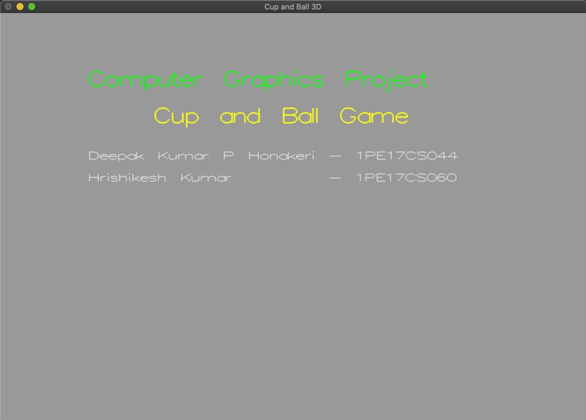
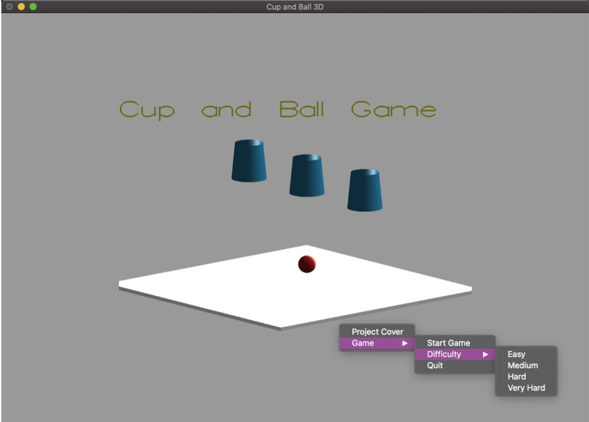
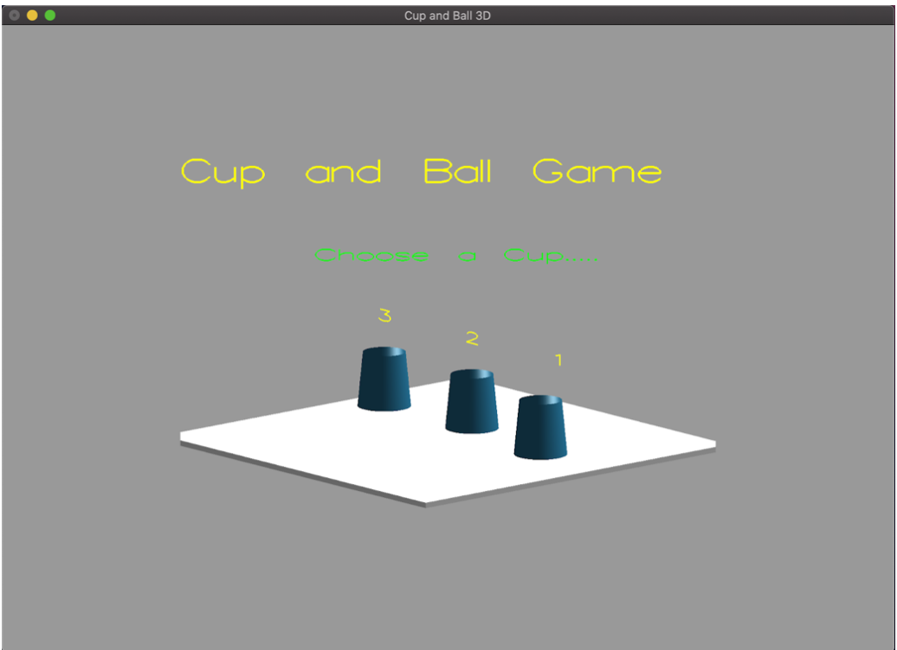
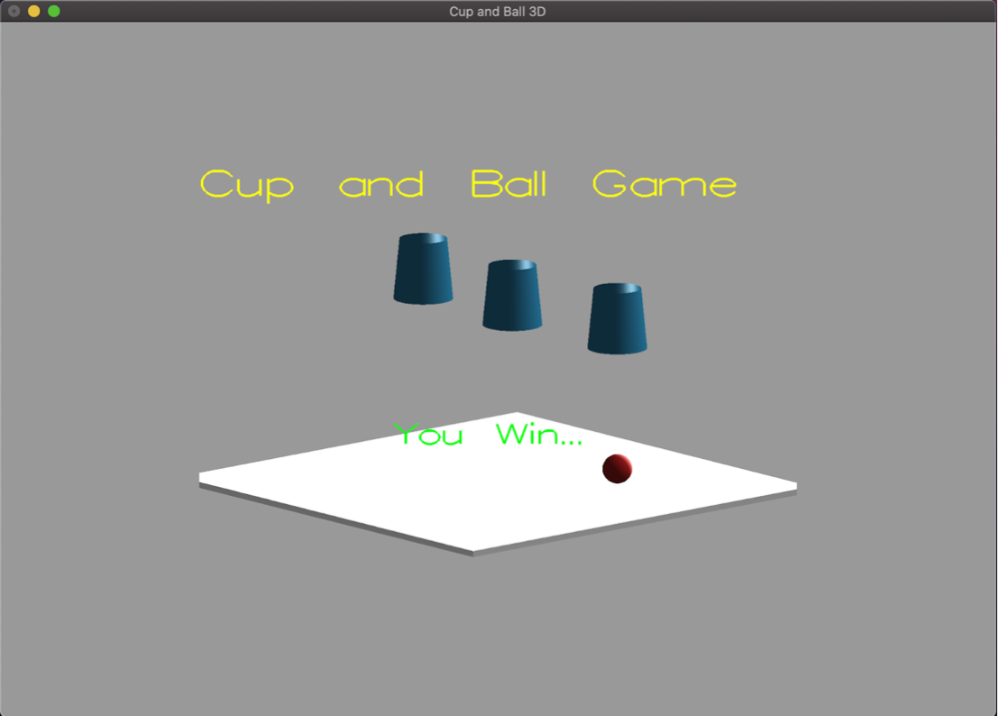
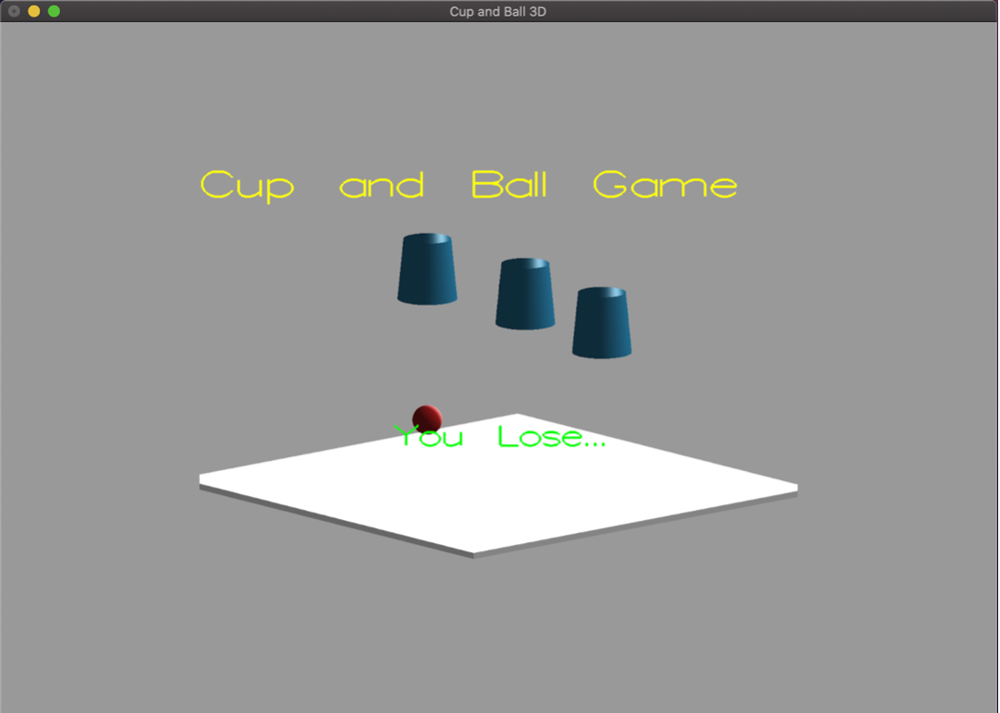

# Cup-and-Ball-3D

A fun and simple 3-Dimensional game built on openGL.

This project is made to run using Xcode on macOS X and can be run on other OS' with the help of IDE and "main.cpp".

## Requirements : 
1. Windows/ Mac OSX/ Linux with openGL and GLUT framework installed.
2. An integrated development environment (IDE) with C++ configured.

## To run :
1. Windows    :   download and double-click  "CG-Mini-Project.exe" to run!
2. Mac OS X  :    directly open the project in Xcode and  Cmd+R to run!
3. Linux          :    compile the "main.cpp" file and run.

## Screenshots

